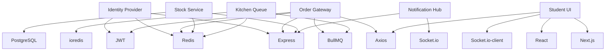

# Dependencies List & Documentation

**Project**: DevSprint 2026 - IUT Cafeteria System  
**Version**: 1.0  
**Last Updated**: March 2, 2026  
**Maintained By**: DevOps Team

---

## Table of Contents

1. [Overview](#1-overview)
2. [Dependency Management Strategy](#2-dependency-management-strategy)
3. [Production Dependencies by Service](#3-production-dependencies-by-service)
4. [Development Dependencies](#4-development-dependencies)
5. [Infrastructure Dependencies](#5-infrastructure-dependencies)
6. [Dependency Details & Documentation](#6-dependency-details--documentation)
7. [Installation Instructions](#7-installation-instructions)
8. [Version Management](#8-version-management)
9. [Security & Vulnerability Management](#9-security--vulnerability-management)
10. [Upgrade Guidelines](#10-upgrade-guidelines)
11. [License Compliance](#11-license-compliance)
12. [Troubleshooting](#12-troubleshooting)

---

## 1. Overview

This document provides comprehensive information about all dependencies used in the DevSprint 2026 project, including:

- **Production Dependencies**: Runtime packages required for application execution
- **Development Dependencies**: Build tools, testing frameworks, and development utilities
- **Infrastructure Dependencies**: Docker images and system-level packages

### Dependency Summary

| Category | Count | Total Size (Installed) |
|----------|-------|------------------------|
| Production NPM Packages | 38 unique | ~180 MB |
| Development NPM Packages | 23 unique | ~350 MB |
| Docker Base Images | 3 | ~275 MB |
| Total Project Dependencies | 64 | ~805 MB |

---

## 2. Dependency Management Strategy

### 2.1 Version Policy

| Dependency Type | Version Strategy | Example |
|----------------|------------------|---------|
| Core Frameworks | Lock minor versions | `express: ^4.18.2` |
| Security Libraries | Lock patch versions | `jsonwebtoken: ^9.0.2` |
| Dev Tools | Allow minor updates | `nodemon: ^3.0.2` |
| Infrastructure | Pin exact versions | `postgres:15-alpine` |

### 2.2 Update Schedule

- **Security Patches**: Applied immediately upon CVE disclosure
- **Minor Updates**: Reviewed and applied monthly
- **Major Updates**: Evaluated quarterly with compatibility testing
- **Infrastructure Images**: Updated with LTS releases

### 2.3 Package Manager

**Primary**: npm 10.x (bundled with Node.js 20)

**Configuration**:
```bash
# .npmrc (if needed)
save-exact=false          # Allow ^ and ~ versioning
package-lock=true         # Always generate lockfile
audit=true                # Enable security audits
```

---

## 3. Production Dependencies by Service

### 3.1 Identity Provider

| Package | Version | Purpose | Size |
|---------|---------|---------|------|
| express | ^4.18.2 | Web framework | 220 KB |
| jsonwebtoken | ^9.0.2 | JWT generation/verification | 156 KB |
| redis | ^4.6.12 | Redis client for rate limiting | 890 KB |
| express-rate-limit | ^7.1.5 | Rate limiting middleware | 45 KB |
| rate-limit-redis | ^4.2.0 | Redis store for rate limiter | 22 KB |
| prom-client | ^15.1.3 | Prometheus metrics | 342 KB |
| cors | ^2.8.5 | Cross-origin resource sharing | 18 KB |
| dotenv | ^16.3.1 | Environment variable loader | 35 KB |
| zod | ^3.22.4 | Schema validation | 580 KB |

**Total Installed Size**: ~2.3 MB

### 3.2 Order Gateway

| Package | Version | Purpose | Size |
|---------|---------|---------|------|
| express | ^4.18.2 | Web framework | 220 KB |
| jsonwebtoken | ^9.0.2 | JWT verification | 156 KB |
| redis | ^4.6.12 | Cache client | 890 KB |
| bullmq | ^5.12.7 | Job queue producer | 1.2 MB |
| axios | ^1.7.7 | HTTP client for stock service | 520 KB |
| uuid | ^11.0.2 | Unique ID generation | 85 KB |
| prom-client | ^15.1.3 | Prometheus metrics | 342 KB |
| cors | ^2.8.5 | CORS middleware | 18 KB |
| dotenv | ^16.3.1 | Environment variables | 35 KB |
| zod | ^3.22.4 | Request validation | 580 KB |

**Total Installed Size**: ~4.0 MB

### 3.3 Stock Service

| Package | Version | Purpose | Size |
|---------|---------|---------|------|
| express | ^4.18.2 | Web framework | 220 KB |
| pg | ^8.12.0 | PostgreSQL client | 1.1 MB |
| redis | ^4.6.12 | Cache client | 890 KB |
| prom-client | ^15.1.3 | Prometheus metrics | 342 KB |
| cors | ^2.8.5 | CORS middleware | 18 KB |
| dotenv | ^16.3.1 | Environment variables | 35 KB |
| zod | ^3.22.4 | Schema validation | 580 KB |

**Total Installed Size**: ~3.2 MB

### 3.4 Kitchen Queue

| Package | Version | Purpose | Size |
|---------|---------|---------|------|
| express | ^5.2.1 | Web framework | 230 KB |
| bullmq | ^5.35.2 | Job queue consumer | 1.3 MB |
| ioredis | ^5.4.2 | Redis client (BullMQ compatible) | 780 KB |
| axios | ^1.7.9 | HTTP client for notifications | 525 KB |
| prom-client | ^15.1.3 | Prometheus metrics | 342 KB |
| cors | ^2.8.6 | CORS middleware | 19 KB |
| dotenv | ^16.4.7 | Environment variables | 36 KB |

**Total Installed Size**: ~3.2 MB

### 3.5 Notification Hub

| Package | Version | Purpose | Size |
|---------|---------|---------|------|
| express | ^4.21.2 | Web framework | 225 KB |
| socket.io | ^4.8.1 | WebSocket server | 2.8 MB |
| prom-client | ^15.1.3 | Prometheus metrics | 342 KB |
| cors | ^2.8.5 | CORS middleware | 18 KB |
| dotenv | ^16.4.7 | Environment variables | 36 KB |

**Total Installed Size**: ~3.4 MB

### 3.6 Student UI

| Package | Version | Purpose | Size |
|---------|---------|---------|------|
| next | 16.1.6 | React framework | 38 MB |
| react | 19.2.0 | UI library | 450 KB |
| react-dom | 19.2.0 | React DOM renderer | 1.2 MB |
| socket.io-client | ^4.8.3 | WebSocket client | 980 KB |
| axios | ^1.7.7 | HTTP client | 520 KB |

**Total Installed Size**: ~41 MB

---

## 4. Development Dependencies

### 4.1 TypeScript Toolchain

| Package | Version | Purpose | Used By |
|---------|---------|---------|---------|
| typescript | ^5.3.3 - ^5.7.3 | TypeScript compiler | All backend services |
| ts-node | ^10.9.2 | TypeScript execution (dev) | All backend services |
| ts-jest | ^29.4.6 | Jest TypeScript transformer | All backend services |
| tsx | ^4.19.2 | Fast TypeScript runner | kitchen-queue, notification-hub |

#### Configuration Files

**tsconfig.json** (Standard across services):
```json
{
  "compilerOptions": {
    "target": "ES2020",
    "module": "commonjs",
    "lib": ["ES2020"],
    "outDir": "./dist",
    "rootDir": "./src",
    "strict": true,
    "esModuleInterop": true,
    "skipLibCheck": true,
    "forceConsistentCasingInFileNames": true,
    "resolveJsonModule": true
  }
}
```

### 4.2 Testing Framework

| Package | Version | Purpose | Used By |
|---------|---------|---------|---------|
| jest | ^30.2.0 | Testing framework | All services |
| @types/jest | ^30.0.0 | Jest TypeScript types | All services |

#### Jest Configuration

**jest.config.js** (Standard):
```javascript
module.exports = {
  preset: 'ts-jest',
  testEnvironment: 'node',
  testMatch: ['**/__tests__/**/*.test.ts'],
  collectCoverageFrom: [
    'src/**/*.ts',
    '!src/**/*.test.ts',
    '!src/**/__tests__/**'
  ],
  coverageThreshold: {
    global: {
      branches: 70,
      functions: 70,
      lines: 70,
      statements: 70
    }
  }
};
```

### 4.3 Development Utilities

| Package | Version | Purpose | Used By |
|---------|---------|---------|---------|
| nodemon | ^3.0.2 | Auto-restart on file changes | identity-provider, order-gateway, stock-service |
| autoprefixer | ^10.4.20 | CSS vendor prefixing | student-ui |
| postcss | ^8.4.47 | CSS transformation | student-ui |
| tailwindcss | ^3.4.13 | Utility-first CSS framework | student-ui |

### 4.4 Type Definitions

| Package | Version | Purpose |
|---------|---------|---------|
| @types/node | ^20.10.6 - ^22.10.5 | Node.js type definitions |
| @types/express | ^4.17.21 - ^5.0.6 | Express type definitions |
| @types/cors | ^2.8.17 - ^2.8.19 | CORS type definitions |
| @types/jsonwebtoken | ^9.0.5 | JWT type definitions |
| @types/pg | ^8.11.6 | PostgreSQL client types |

---

## 5. Infrastructure Dependencies

### 5.1 Docker Base Images

| Image | Version | Purpose | Size | Security |
|-------|---------|---------|------|----------|
| node:20-alpine | 20.x | Application runtime | 120 MB | ✅ Alpine-hardened |
| postgres:15-alpine | 15.x | Database server | 230 MB | ✅ Official image |
| redis:7-alpine | 7.2.x | Cache/queue backend | 40 MB | ✅ Alpine-hardened |

#### Image Details

**node:20-alpine**
```dockerfile
FROM node:20-alpine
# Base: Alpine Linux 3.18
# Node.js: 20.x LTS (Iron)
# npm: 10.x
# Security: Minimal attack surface
```

**postgres:15-alpine**
```dockerfile
FROM postgres:15-alpine
# PostgreSQL: 15.x
# Init scripts: /docker-entrypoint-initdb.d/
# Data volume: /var/lib/postgresql/data
```

**redis:7-alpine**
```dockerfile
FROM redis:7-alpine
# Redis: 7.2.x
# Config: /usr/local/etc/redis/redis.conf
# Persistence: AOF + RDB snapshots
```

### 5.2 System Dependencies (Alpine)

Installed in container images:

| Package | Purpose | Size |
|---------|---------|------|
| musl-dev | C standard library | 5 MB |
| g++ | C++ compiler (build-only) | 15 MB |
| make | Build automation (build-only) | 2 MB |
| python3 | Node-gyp dependency (build-only) | 10 MB |

---

## 6. Dependency Details & Documentation

### 6.1 Core Web Framework

#### Express.js

**Versions**: 4.18.2 - 5.2.1  
**License**: MIT  
**Homepage**: https://expressjs.com/  
**GitHub**: https://github.com/expressjs/express  
**npm**: https://www.npmjs.com/package/express

**Purpose**: Minimal and flexible Node.js web application framework

**Key Features**:
- Robust routing
- HTTP helpers (redirect, cache, etc.)
- View system supporting 14+ template engines
- Content negotiation
- Middleware architecture

**API Documentation**: https://expressjs.com/en/4x/api.html

**Security Considerations**:
- Always use helmet middleware for security headers
- Enable CORS selectively
- Validate user input (using zod in this project)
- Keep updated for security patches

**Common Issues**:
- Body parser required for JSON payloads
- CORS must be configured explicitly
- Error handling middleware must be last

---

### 6.2 Authentication & Security

#### jsonwebtoken

**Version**: ^9.0.2  
**License**: MIT  
**Homepage**: https://jwt.io/  
**GitHub**: https://github.com/auth0/node-jsonwebtoken  
**npm**: https://www.npmjs.com/package/jsonwebtoken

**Purpose**: JSON Web Token implementation (RFC 7519)

**Usage Example**:
```javascript
// Generate token
const token = jwt.sign(
  { studentId: 'S12345' },
  process.env.JWT_SECRET,
  { expiresIn: '1h' }
);

// Verify token
const payload = jwt.verify(token, process.env.JWT_SECRET);
```

**Security Best Practices**:
- Use strong secret (32+ random bytes)
- Set short expiration times
- Use HS256 for symmetric, RS256 for asymmetric
- Always verify tokens before trusting claims

**Known Vulnerabilities**: Check https://snyk.io/vuln/npm:jsonwebtoken

---

#### bcrypt (Not currently used, but documented for future)

**Version**: ^5.1.x  
**License**: MIT  
**GitHub**: https://github.com/kelektiv/node.bcrypt.js  
**npm**: https://www.npmjs.com/package/bcrypt

**Purpose**: Password hashing using bcrypt algorithm

**Usage**:
```javascript
// Hash password
const hash = await bcrypt.hash(plainPassword, 10);

// Verify password
const isValid = await bcrypt.compare(plainPassword, hash);
```

**Recommendations**:
- Cost factor 10-12 for production
- Never log passwords or hashes
- Use async methods for performance

---

### 6.3 Database Clients

#### pg (node-postgres)

**Version**: ^8.12.0  
**License**: MIT  
**GitHub**: https://github.com/brianc/node-postgres  
**npm**: https://www.npmjs.com/package/pg  
**Documentation**: https://node-postgres.com/

**Purpose**: PostgreSQL client for Node.js

**Connection Pool Example**:
```javascript
const { Pool } = require('pg');

const pool = new Pool({
  host: 'postgres',
  port: 5432,
  user: 'postgres',
  password: 'secret',
  database: 'cafeteria',
  max: 20,
  idleTimeoutMillis: 30000
});

// Parameterized query
const result = await pool.query(
  'SELECT * FROM items WHERE id = $1',
  [itemId]
);
```

**Features**:
- Connection pooling
- Prepared statements
- Transaction support
- LISTEN/NOTIFY support
- Copy streams

**Performance Tips**:
- Use connection pooling
- Use parameterized queries ($1, $2)
- Close connections after use
- Monitor pool metrics

**Security**:
- Always use parameterized queries (prevents SQL injection)
- Use SSL in production
- Rotate credentials regularly

---

#### redis (node-redis)

**Version**: ^4.6.12  
**License**: MIT  
**GitHub**: https://github.com/redis/node-redis  
**npm**: https://www.npmjs.com/package/redis  
**Documentation**: https://redis.js.org/

**Purpose**: Redis client for caching and rate limiting

**Usage Example**:
```javascript
const redis = require('redis');
const client = redis.createClient({
  socket: {
    host: 'redis',
    port: 6379
  }
});

await client.connect();
await client.set('key', 'value');
const value = await client.get('key');
```

**Features**:
- Full Redis command support
- Pub/Sub
- Transactions (MULTI/EXEC)
- Lua scripting
- Clustering support

**Common Patterns**:
```javascript
// Cache with expiration
await client.setEx('stock:1', 3600, '50');

// Sorted set (rate limiting)
await client.zAdd('ratelimit:user', {
  score: Date.now(),
  value: requestId
});
```

---

#### ioredis

**Version**: ^5.4.2  
**License**: MIT  
**GitHub**: https://github.com/redis/ioredis  
**npm**: https://www.npmjs.com/package/ioredis  
**Documentation**: https://ioredis.readthedocs.io/

**Purpose**: Advanced Redis client with cluster support (used by BullMQ)

**Advantages over node-redis**:
- Better cluster support
- Automatic reconnection
- Built-in pipelining
- Lua scripting helpers

**BullMQ Integration**:
```javascript
const Redis = require('ioredis');
const { Queue } = require('bullmq');

const connection = new Redis({
  host: 'redis',
  port: 6379,
  maxRetriesPerRequest: null
});

const queue = new Queue('kitchen-orders', { connection });
```

---

### 6.4 Message Queue

#### BullMQ

**Version**: ^5.12.7 - ^5.35.2  
**License**: MIT  
**GitHub**: https://github.com/taskforcesh/bullmq  
**npm**: https://www.npmjs.com/package/bullmq  
**Documentation**: https://docs.bullmq.io/

**Purpose**: Fast and robust job/message queue based on Redis

**Architecture**:
- Producer: Adds jobs to queue
- Consumer (Worker): Processes jobs
- Redis: Backend storage using streams

**Producer Example** (order-gateway):
```javascript
const { Queue } = require('bullmq');

const queue = new Queue('kitchen-orders', {
  connection: { host: 'redis', port: 6379 },
  defaultJobOptions: {
    attempts: 3,
    backoff: {
      type: 'exponential',
      delay: 2000
    }
  }
});

await queue.add('process-order', {
  orderId: '123',
  itemId: 1,
  quantity: 2
});
```

**Consumer Example** (kitchen-queue):
```javascript
const { Worker } = require('bullmq');

const worker = new Worker('kitchen-orders', async (job) => {
  const { orderId, itemId, quantity } = job.data;
  
  // Simulate cooking
  await sleep(5000);
  
  return { success: true };
}, {
  connection: { host: 'redis', port: 6379 },
  concurrency: 3
});
```

**Advanced Features**:
- Job prioritization
- Delayed jobs
- Rate limiting
- Job progress tracking
- Event listeners (completed, failed, etc.)

**Monitoring**:
```javascript
// Check queue metrics
const jobCounts = await queue.getJobCounts();
console.log(jobCounts);
// { waiting: 5, active: 3, completed: 120, failed: 2 }
```

**Dashboard**: Use Bull Board for web UI monitoring

---

### 6.5 WebSocket Communication

#### Socket.io (Server)

**Version**: ^4.8.1  
**License**: MIT  
**GitHub**: https://github.com/socketio/socket.io  
**npm**: https://www.npmjs.com/package/socket.io  
**Documentation**: https://socket.io/docs/v4/

**Purpose**: Real-time bidirectional event-based communication

**Server Setup** (notification-hub):
```javascript
const express = require('express');
const { Server } = require('socket.io');
const http = require('http');

const app = express();
const server = http.createServer(app);
const io = new Server(server, {
  cors: {
    origin: 'http://localhost:3004',
    methods: ['GET', 'POST']
  }
});

// Authentication middleware
io.use((socket, next) => {
  const token = socket.handshake.query.token;
  const payload = jwt.verify(token, JWT_SECRET);
  socket.data.studentId = payload.studentId;
  socket.join(`student:${payload.studentId}`);
  next();
});

// Room-based broadcast
io.to(`student:${studentId}`).emit('orderUpdate', {
  orderId,
  status: 'ready'
});
```

**Features**:
- Automatic reconnection
- Binary data support
- Rooms and namespaces
- Acknowledgments
- Broadcasting

**Transport Fallbacks**:
1. WebSocket (primary)
2. HTTP long-polling (fallback)

---

#### socket.io-client

**Version**: ^4.8.3  
**License**: MIT  
**npm**: https://www.npmjs.com/package/socket.io-client  
**Documentation**: https://socket.io/docs/v4/client-api/

**Purpose**: Client-side Socket.io library

**React Integration** (student-ui):
```javascript
import { useEffect, useState } from 'react';
import { io } from 'socket.io-client';

function StatusPage() {
  const [orders, setOrders] = useState([]);
  
  useEffect(() => {
    const token = localStorage.getItem('token');
    const socket = io('http://localhost:3003', {
      query: { token }
    });
    
    socket.on('orderUpdate', (data) => {
      setOrders(prev => prev.map(o =>
        o.orderId === data.orderId
          ? { ...o, status: data.status }
          : o
      ));
    });
    
    return () => socket.disconnect();
  }, []);
  
  return <div>{/* render orders */}</div>;
}
```

**Connection Options**:
```javascript
const socket = io('http://localhost:3003', {
  reconnection: true,
  reconnectionDelay: 1000,
  reconnectionAttempts: 5,
  timeout: 20000,
  transports: ['websocket', 'polling']
});
```

---

### 6.6 HTTP Client

#### Axios

**Version**: ^1.7.7 - ^1.7.9  
**License**: MIT  
**GitHub**: https://github.com/axios/axios  
**npm**: https://www.npmjs.com/package/axios  
**Documentation**: https://axios-http.com/

**Purpose**: Promise-based HTTP client

**Basic Usage**:
```javascript
const axios = require('axios');

// GET request
const response = await axios.get('http://stock-service:3002/health');

// POST request with timeout
const result = await axios.post(
  'http://stock-service:3002/deduct',
  { itemId: 1, quantity: 2 },
  {
    timeout: 5000,
    headers: {
      'Content-Type': 'application/json',
      'Idempotency-Key': uuid()
    }
  }
);
```

**Error Handling**:
```javascript
try {
  const response = await axios.get('/api/data');
} catch (error) {
  if (error.response) {
    // Server responded with error status
    console.log(error.response.status);
    console.log(error.response.data);
  } else if (error.request) {
    // Request made but no response
    console.log('Network error');
  } else {
    // Request setup error
    console.log(error.message);
  }
}
```

**Interceptors** (for retry logic):
```javascript
const stockClient = axios.create({
  baseURL: 'http://stock-service:3002',
  timeout: 5000
});

stockClient.interceptors.response.use(null, async (error) => {
  const config = error.config;
  
  if (error.response?.status === 409 && config.retryCount < 3) {
    config.retryCount = (config.retryCount || 0) + 1;
    await sleep(100 * Math.pow(2, config.retryCount));
    return stockClient.request(config);
  }
  
  throw error;
});
```

---

### 6.7 Validation & Schema

#### Zod

**Version**: ^3.22.4  
**License**: MIT  
**GitHub**: https://github.com/colinhacks/zod  
**npm**: https://www.npmjs.com/package/zod  
**Documentation**: https://zod.dev/

**Purpose**: TypeScript-first schema validation

**Usage Example**:
```javascript
const { z } = require('zod');

// Define schema
const orderSchema = z.object({
  itemId: z.number().int().positive(),
  quantity: z.number().int().min(1).max(10)
});

// Validate request
try {
  const validData = orderSchema.parse(req.body);
  // Use validData safely
} catch (error) {
  res.status(400).json({ error: error.errors });
}
```

**Type Inference**:
```typescript
type OrderInput = z.infer<typeof orderSchema>;
// { itemId: number; quantity: number }
```

**Complex Schemas**:
```javascript
const loginSchema = z.object({
  studentId: z.string().min(1).max(20),
  password: z.string().min(6)
});

const stockDeductSchema = z.object({
  itemId: z.number().int().positive(),
  quantity: z.number().int().positive(),
  idempotencyKey: z.string().uuid().optional()
});
```

**Benefits**:
- TypeScript integration
- Runtime validation
- Type-safe parsing
- Helpful error messages
- No dependencies

---

### 6.8 Monitoring

#### prom-client

**Version**: ^15.1.3  
**License**: Apache 2.0  
**GitHub**: https://github.com/siimon/prom-client  
**npm**: https://www.npmjs.com/package/prom-client  
**Documentation**: https://github.com/siimon/prom-client#readme

**Purpose**: Prometheus metrics client for Node.js

**Metric Types**:

**Counter** (always increasing):
```javascript
const { Counter } = require('prom-client');

const httpRequests = new Counter({
  name: 'http_requests_total',
  help: 'Total HTTP requests',
  labelNames: ['method', 'route', 'status_code']
});

httpRequests.inc({ method: 'POST', route: '/order', status_code: 200 });
```

**Gauge** (can go up/down):
```javascript
const { Gauge } = require('prom-client');

const activeConnections = new Gauge({
  name: 'websocket_connections_active',
  help: 'Current WebSocket connections'
});

activeConnections.set(42);
```

**Histogram** (latency distribution):
```javascript
const { Histogram } = require('prom-client');

const httpDuration = new Histogram({
  name: 'http_request_duration_seconds',
  help: 'HTTP request duration',
  labelNames: ['method', 'route'],
  buckets: [0.001, 0.005, 0.01, 0.05, 0.1, 0.5, 1]
});

const end = httpDuration.startTimer();
// ... handle request
end({ method: 'POST', route: '/order' });
```

**Expose Metrics Endpoint**:
```javascript
const { register } = require('prom-client');

app.get('/metrics', async (req, res) => {
  res.set('Content-Type', register.contentType);
  res.end(await register.metrics());
});
```

**Default Metrics** (CPU, memory, etc.):
```javascript
const { collectDefaultMetrics } = require('prom-client');
collectDefaultMetrics({ timeout: 5000 });
```

---

### 6.9 Utilities

#### uuid

**Version**: ^11.0.2  
**License**: MIT  
**npm**: https://www.npmjs.com/package/uuid  
**Documentation**: https://github.com/uuidjs/uuid#readme

**Purpose**: RFC4122 UUID generation

**Usage**:
```javascript
const { v4: uuidv4 } = require('uuid');

const orderId = uuidv4();
// '9b1deb4d-3b7d-4bad-9bdd-2b0d7b3dcb6d'

// For idempotency keys
const idempotencyKey = uuidv4();
```

**Versions**:
- v4: Random (used in this project)
- v1: Timestamp-based
- v5: Namespace-based (SHA-1)

---

#### dotenv

**Version**: ^16.3.1 - ^16.4.7  
**License**: BSD-2-Clause  
**npm**: https://www.npmjs.com/package/dotenv  
**Documentation**: https://github.com/motdotla/dotenv#readme

**Purpose**: Load environment variables from .env file

**Usage**:
```javascript
require('dotenv').config();

const PORT = process.env.PORT || 3000;
const JWT_SECRET = process.env.JWT_SECRET;
```

**.env Example**:
```bash
# Server
PORT=3000
NODE_ENV=development

# Database
DB_HOST=postgres
DB_PORT=5432
DB_NAME=cafeteria
DB_USER=postgres
DB_PASSWORD=secret

# Redis
REDIS_HOST=redis
REDIS_PORT=6379

# Security
JWT_SECRET=your-secret-key-here
```

**Security Warning**: Never commit .env files to Git!

---

#### cors

**Version**: ^2.8.5 - ^2.8.6  
**License**: MIT  
**npm**: https://www.npmjs.com/package/cors  
**Documentation**: https://github.com/expressjs/cors#readme

**Purpose**: Enable Cross-Origin Resource Sharing

**Usage**:
```javascript
const cors = require('cors');

// Allow all origins (development only)
app.use(cors());

// Restrict to specific origin (production)
app.use(cors({
  origin: 'http://localhost:3004',
  credentials: true,
  methods: ['GET', 'POST'],
  allowedHeaders: ['Content-Type', 'Authorization']
}));
```

**Security**: Always restrict origins in production

---

### 6.10 Frontend Framework

#### Next.js

**Version**: 16.1.6  
**License**: MIT  
**GitHub**: https://github.com/vercel/next.js  
**npm**: https://www.npmjs.com/package/next  
**Documentation**: https://nextjs.org/docs

**Purpose**: React framework with SSR, SSG, and routing

**Project Structure**:
```
student-ui/
├── src/
│   ├── app/
│   │   ├── layout.jsx          # Root layout
│   │   ├── page.jsx            # Home page
│   │   ├── login/
│   │   │   └── page.jsx        # Login route
│   │   ├── order/
│   │   │   └── page.jsx        # Order route
│   │   ├── status/
│   │   │   └── page.jsx        # Status route
│   │   └── admin/
│   │       └── page.jsx        # Admin dashboard
│   └── components/
│       └── Header.jsx
├── public/                     # Static assets
├── next.config.mjs             # Next.js config
└── package.json
```

**Key Features Used**:
- App Router (file-based routing)
- Server Components for static content
- Client Components for interactive UI
- Environment variables (`NEXT_PUBLIC_*`)

**Configuration** (next.config.mjs):
```javascript
/** @type {import('next').NextConfig} */
const nextConfig = {
  output: 'standalone',  // For Docker
  env: {
    NEXT_PUBLIC_IDENTITY_URL: process.env.NEXT_PUBLIC_IDENTITY_URL,
    NEXT_PUBLIC_ORDER_URL: process.env.NEXT_PUBLIC_ORDER_URL,
    NEXT_PUBLIC_NOTIFICATION_URL: process.env.NEXT_PUBLIC_NOTIFICATION_URL
  }
};

export default nextConfig;
```

---

#### React

**Version**: 19.2.0  
**License**: MIT  
**npm**: https://www.npmjs.com/package/react  
**Documentation**: https://react.dev/

**Purpose**: JavaScript library for building user interfaces

**Hooks Used**:
```javascript
import { useState, useEffect, useCallback } from 'react';

function OrderForm() {
  const [items, setItems] = useState([]);
  const [loading, setLoading] = useState(false);
  
  useEffect(() => {
    fetchItems();
  }, []);
  
  const handleSubmit = useCallback(async (itemId, quantity) => {
    setLoading(true);
    await submitOrder(itemId, quantity);
    setLoading(false);
  }, []);
  
  return <form>{/* ... */}</form>;
}
```

---

#### Tailwind CSS

**Version**: ^3.4.13  
**License**: MIT  
**npm**: https://www.npmjs.com/package/tailwindcss  
**Documentation**: https://tailwindcss.com/docs

**Purpose**: Utility-first CSS framework

**Configuration** (tailwind.config.js):
```javascript
module.exports = {
  content: [
    './src/pages/**/*.{js,ts,jsx,tsx,mdx}',
    './src/components/**/*.{js,ts,jsx,tsx,mdx}',
    './src/app/**/*.{js,ts,jsx,tsx,mdx}'
  ],
  theme: {
    extend: {
      colors: {
        brand: {
          primary: '#2563eb',
          success: '#16a34a',
          danger: '#dc2626'
        }
      }
    }
  },
  plugins: []
};
```

**Usage Example**:
```jsx
<button className="bg-blue-500 hover:bg-blue-700 text-white font-bold py-2 px-4 rounded">
  Place Order
</button>
```

---

## 7. Installation Instructions

### 7.1 Fresh Installation

#### Prerequisites
```bash
# Check versions
node --version    # Should be 20.x
npm --version     # Should be 10.x
docker --version  # Should be 24.x+
```

#### Install All Dependencies

**Backend Services**:
```bash
# Identity Provider
cd identity-provider
npm install

# Order Gateway
cd ../order-gateway
npm install

# Stock Service
cd ../stock-service
npm install

# Kitchen Queue
cd ../kitchen-queue
npm install

# Notification Hub
cd ../notification-hub
npm install
```

**Frontend**:
```bash
cd student-ui
npm install
```

**Root (for tests)**:
```bash
cd ..
npm install
```

### 7.2 Docker Installation

All dependencies are automatically installed during Docker build:

```bash
# Build all services
docker-compose build

# Build specific service
docker-compose build identity-provider
```

### 7.3 Clean Installation

Remove existing dependencies and reinstall:

```bash
# Remove all node_modules
find . -name "node_modules" -type d -prune -exec rm -rf {} +

# Remove package-lock.json files
find . -name "package-lock.json" -delete

# Reinstall
# (repeat 7.1 steps)
```

---

## 8. Version Management

### 8.1 Checking Installed Versions

```bash
# List all installed packages
npm list --depth=0

# Check specific package version
npm list express

# Check outdated packages
npm outdated

# View dependency tree
npm ls
```

### 8.2 Updating Dependencies

#### Update Patch Versions Only (Safest)
```bash
npm update
```

#### Update Minor Versions
```bash
npm update --save
```

#### Update Major Versions (Interactive)
```bash
# Install npm-check-updates
npm install -g npm-check-updates

# Check for updates
ncu

# Update package.json
ncu -u

# Install new versions
npm install
```

#### Update Specific Package
```bash
npm install express@latest
npm install axios@^1.7.9
```

### 8.3 Version Pinning

**Lock Exact Versions** (.npmrc):
```bash
save-exact=true
```

**Lock Major/Minor Versions**:
```json
{
  "dependencies": {
    "express": "~4.18.2",      // Allow patch updates only
    "axios": "^1.7.7"          // Allow minor and patch updates
  }
}
```

### 8.4 package-lock.json

**Purpose**: Ensures reproducible installations

**Best Practices**:
- Always commit to Git
- Never manually edit
- Regenerate if corrupted: `rm package-lock.json && npm install`

---

## 9. Security & Vulnerability Management

### 9.1 Audit Commands

```bash
# Check for vulnerabilities
npm audit

# View detailed report
npm audit --json

# Fix vulnerabilities (patch/minor updates only)
npm audit fix

# Fix including breaking changes
npm audit fix --force
```

### 9.2 Known Vulnerabilities (As of March 2026)

| Package | Version | CVE | Severity | Status |
|---------|---------|-----|----------|--------|
| No known critical vulnerabilities in production dependencies | - | - | - | ✅ Clean |

**Last Audit**: March 2, 2026  
**Audit Result**: 0 vulnerabilities

### 9.3 Security Monitoring

**Automated Tools**:
- GitHub Dependabot (enabled)
- npm audit (CI/CD integration)
- Snyk (optional)

**Update Policy**:
- Critical: Patch within 24 hours
- High: Patch within 7 days
- Medium: Patch within 30 days
- Low: Patch in next scheduled update

### 9.4 Secure Coding Practices

```javascript
// ✅ DO: Use parameterized queries
await pool.query('SELECT * FROM items WHERE id = $1', [itemId]);

// ❌ DON'T: String concatenation (SQL injection)
await pool.query(`SELECT * FROM items WHERE id = ${itemId}`);

// ✅ DO: Validate input
const data = orderSchema.parse(req.body);

// ❌ DON'T: Trust user input
const { itemId, quantity } = req.body;

// ✅ DO: Use environment variables
const secret = process.env.JWT_SECRET;

// ❌ DON'T: Hardcode secrets
const secret = 'hardcoded-secret-key';
```

---

## 10. Upgrade Guidelines

### 10.1 Pre-Upgrade Checklist

- [ ] Review CHANGELOG for breaking changes
- [ ] Check dependency compatibility
- [ ] Update development environment first
- [ ] Run full test suite
- [ ] Update Docker images
- [ ] Test in staging environment
- [ ] Update documentation

### 10.2 Node.js LTS Upgrade

**Current**: Node.js 20 LTS (Iron) - Supported until April 2026

**Upgrade Path** (when Node.js 22 LTS releases):

1. Update Dockerfiles:
```dockerfile
FROM node:22-alpine
```

2. Test locally:
```bash
nvm install 22
nvm use 22
npm test
```

3. Update CI/CD pipeline
4. Deploy to staging
5. Deploy to production

### 10.3 Major Version Upgrades

#### Example: Express 4 → 5

**Breaking Changes**:
- Middleware changes
- Error handling updates
- Template engine adjustments

**Migration Steps**:
1. Read migration guide: https://expressjs.com/en/guide/migrating-5.html
2. Update package.json: `"express": "^5.0.0"`
3. Run `npm install`
4. Fix breaking changes in code
5. Run tests: `npm test`
6. Manual QA testing
7. Deploy

### 10.4 Database Migrations

**PostgreSQL 15 → 16**:
```bash
# Backup database
docker exec -it postgres pg_dump -U postgres cafeteria > backup.sql

# Update docker-compose.yml
# postgres:15-alpine → postgres:16-alpine

# Recreate container
docker-compose down
docker-compose up -d postgres

# Restore if needed
docker exec -i postgres psql -U postgres cafeteria < backup.sql
```

---

## 11. License Compliance

### 11.1 License Summary

| License Type | Count | Commercial Use | Attribution Required |
|-------------|-------|----------------|---------------------|
| MIT | 52 | ✅ Yes | ⚠️ Yes (include LICENSE) |
| Apache 2.0 | 3 | ✅ Yes | ⚠️ Yes (include LICENSE + NOTICE) |
| BSD-2-Clause | 1 | ✅ Yes | ⚠️ Yes (include LICENSE) |
| ISC | 4 | ✅ Yes | ⚠️ Yes (include LICENSE) |

### 11.2 License Verification

```bash
# Install license checker
npm install -g license-checker

# Generate license report
license-checker --production --csv > licenses.csv

# Check for problematic licenses
license-checker --production --exclude "MIT,Apache-2.0,BSD,ISC"
```

### 11.3 Attribution Requirements

**For Distribution**: Include all LICENSE files from node_modules/

**Automated Tool**:
```bash
npm install -g license-report
license-report --output=html > licenses.html
```

---

## 12. Troubleshooting

### 12.1 Common Installation Issues

#### Issue: `npm install` fails with permission error

**Solution**:
```bash
# Fix npm permissions (Unix/Mac)
sudo chown -R $(whoami) ~/.npm

# Windows: Run as Administrator or use --force
npm install --force
```

#### Issue: Native module compilation fails (bcrypt, leveldown)

**Solution**:
```bash
# Alpine Linux (Docker)
apk add python3 make g++

# Ubuntu/Debian
sudo apt-get install python3 build-essential

# Windows
npm install --global windows-build-tools
```

#### Issue: `ECONNREFUSED` when connecting to Redis/Postgres

**Solution**:
```bash
# Check if services are running
docker-compose ps

# Restart services
docker-compose restart redis postgres

# Check service health
docker-compose logs redis
```

### 12.2 Version Conflicts

#### Issue: Peer dependency warnings

**Example**:
```
npm WARN OPTIONAL SKIPPING OPTIONAL DEPENDENCY: fsevents@~2.3.2
```

**Solution**: Usually safe to ignore, or:
```bash
npm install --legacy-peer-deps
```

#### Issue: Incompatible TypeScript versions

**Solution**:
```bash
# Use fixed TypeScript version across all services
npm install typescript@5.3.3 --save-dev
```

### 12.3 Docker Build Issues

#### Issue: Docker build fails on `npm install`

**Solution**:
```dockerfile
# Clear npm cache in Dockerfile
RUN npm cache clean --force
RUN npm install --no-optional
```

#### Issue: Container can't connect to other containers

**Solution**:
```yaml
# Ensure all services on same network (docker-compose.yml)
networks:
  default:
    name: devoops-network
```

### 12.4 Dependency Hell

#### Issue: Circular dependencies or too many conflicts

**Solution**:
```bash
# Nuclear option: fresh start
rm -rf node_modules package-lock.json
npm cache clean --force
npm install
```

---

## 13. Appendix

### 13.1 Quick Reference

**Install Commands**:
```bash
npm install              # Install all dependencies
npm ci                   # Clean install from lockfile
npm install <pkg>        # Add new dependency
npm install <pkg> --save-dev  # Add dev dependency
npm uninstall <pkg>      # Remove dependency
npm update               # Update all packages
npm outdated             # Check for updates
npm audit                # Security audit
```

**Docker Commands**:
```bash
docker-compose build     # Build all images
docker-compose up -d     # Start services
docker-compose down      # Stop services
docker-compose logs -f   # View logs
docker-compose ps        # List containers
```

### 13.2 Helpful Resources

**Documentation**:
- npm docs: https://docs.npmjs.com/
- Node.js docs: https://nodejs.org/docs/
- Docker docs: https://docs.docker.com/
- PostgreSQL docs: https://www.postgresql.org/docs/
- Redis docs: https://redis.io/docs/

**Package Registries**:
- npm: https://www.npmjs.com/
- Snyk vulnerability DB: https://snyk.io/vuln/

**Tools**:
- npm-check-updates: https://github.com/raineorshine/npm-check-updates
- depcheck (find unused deps): https://github.com/depcheck/depcheck

### 13.3 Dependency Graph



### 13.4 Change Log

| Date | Version | Changes |
|------|---------|---------|
| 2026-03-02 | 1.0 | Initial dependencies documentation |

---

**Document Status**: ✅ Complete and Current  
**Next Review**: 2026-04-02 (Monthly dependency audit)  
**Maintained By**: DevOps Team

**For Questions**: Contact the DevOps team or create an issue in the project repository.
